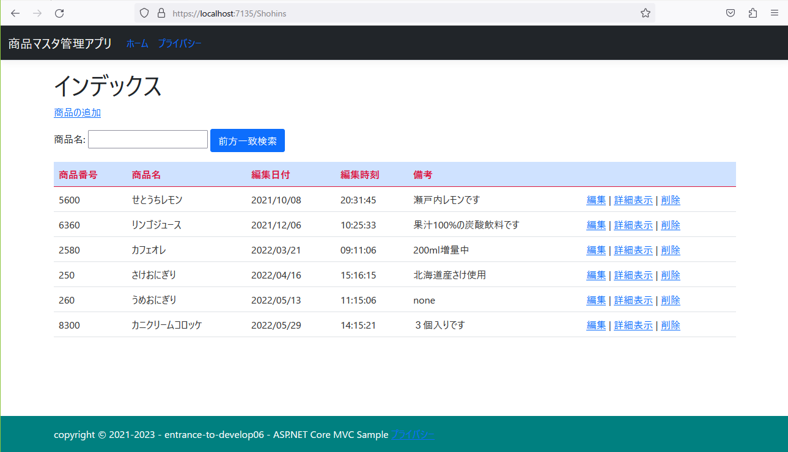
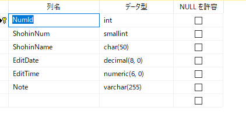

### :octocat: ASP.NET CoreでEntityFramework Coreを使いSQLServerとの読み書きサンプル
___
## 開発環境
```
統合開発環境：Microsoft Visual Studio 2022 Community Edition 17.5.5
言語：C# 10  
フレームワーク：ASP.NET Core MVC 6.0.16
開発SDK：.NET 6.0.408
Webサーバー：IIS(Internet Information Services) Express 10.0.07728  
テンプレートエンジン：Razor View  
データベース：Microsoft SQL Server 2022 Express CU3  
-データベース管理ツール：Microsoft SQL Server Management Studio 19.0.2  
データベース接続：.NET Framework Data Provider for SQL Server
O/R マッピングフレームワーク：Entity Framework Core SQLServer 6.0.16  
CSSテンプレート：Bootstrap 5.1.0  
JavaScriptライブラリー：JQuery 3.5.1
```

#### 一覧・イメージ
  

#### 追加・イメージ
  

#### データベース・イメージ
  